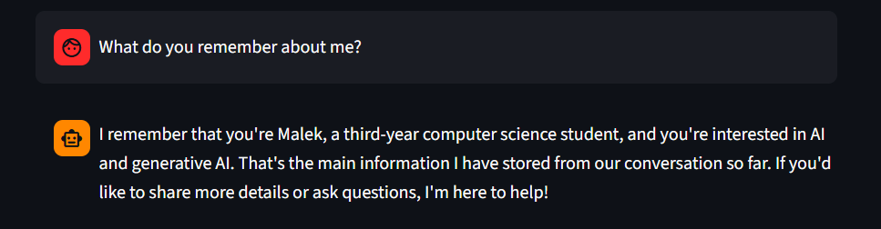
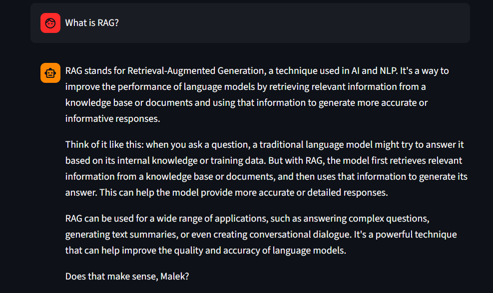
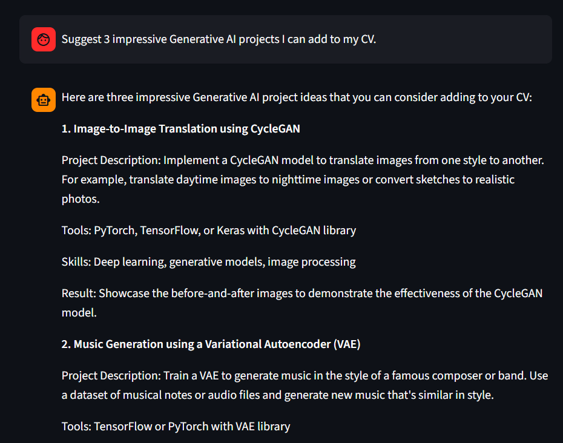
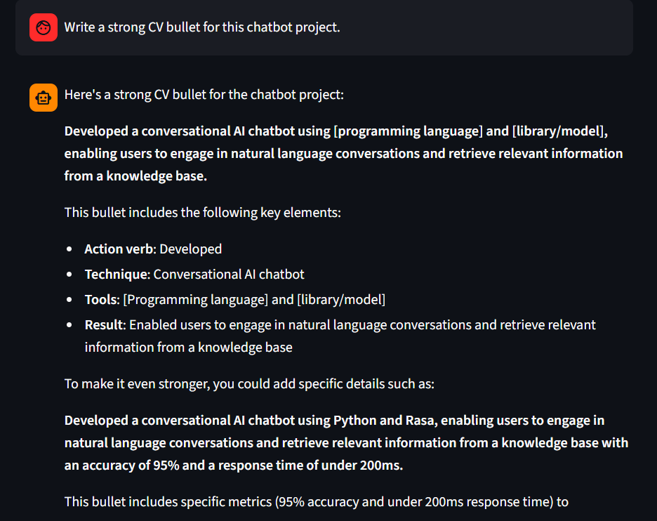

# AI Career Mentor Chatbot with Memory

## Overview

AI Career Mentor Chatbot is a Streamlit-based Generative AI web application designed to help computer science students with AI learning, internship preparation, CV improvement, GitHub project ideas, and career planning.

The chatbot is powered by the Groq API and implements session-based memory, allowing it to remember previous user messages during the active chat session. The project demonstrates the core concept of turning a stateless LLM API call into a contextual chatbot by storing and reusing conversation history.

## Project Goal

The goal of this project is to build a custom AI chatbot that remembers previous user messages during a live session. The chatbot maintains an active in-memory message history and sends the conversation context with every new request to preserve continuity.

## Features

* Interactive Streamlit web interface
* Integration with Groq LLM API
* Session-based memory using `st.session_state`
* Stores both user messages and assistant responses
* Sends conversation history with each new request
* Sliding-window memory management to limit long conversations
* System prompt to control chatbot behavior
* Local AI career knowledge base
* Knowledge base retrieval for AI-related questions
* Clear chat button
* Memory counter in the sidebar
* Download conversation as a text file
* Input validation to avoid empty requests

## Technologies Used

* Python
* Streamlit
* Groq API
* python-dotenv
* Local Markdown knowledge base

## Project Structure

```text
ai-career-mentor-chatbot/
│
├── app.py
├── prompts.py
├── .env
├── .gitignore
├── requirements.txt
├── README.md
│
├── knowledge_base/
│   └── ai_career_guide.md
│
└── utils/
    ├── memory.py
    └── retriever.py
```

## How the Memory Works

Most LLM API calls are stateless, meaning the model does not automatically remember previous messages. This project solves that problem by storing the conversation history inside Streamlit session state.

Each time the user sends a message:

1. The user message is added to memory.
2. The full conversation history is sent to the LLM.
3. The assistant response is generated.
4. The assistant response is added back to memory.

This allows the chatbot to answer follow-up questions based on previous messages in the same session.

## Local Knowledge Base

The project includes a local Markdown knowledge base containing information about:

* Artificial Intelligence
* Machine Learning
* Deep Learning
* Generative AI
* Large Language Models
* Prompt Engineering
* RAG
* Fine-tuning
* AI Engineer Roadmap
* AI internship project ideas
* Writing AI projects on a CV

When the user asks a related question, the retriever searches the knowledge base and sends relevant context to the model.

## Installation

1. Clone the repository:

```bash
git clone https://github.com/your-username/ai-career-mentor-chatbot.git
```

2. Navigate to the project folder:

```bash
cd ai-career-mentor-chatbot
```

3. Create a virtual environment:

```bash
python -m venv venv
```

4. Activate the virtual environment:

```bash
venv\Scripts\activate
```

5. Install the required packages:

```bash
pip install -r requirements.txt
```

## Environment Variables

Create a `.env` file in the project folder and add your Groq API key:

```env
GROQ_API_KEY=your_groq_api_key_here
GROQ_MODEL=llama-3.1-8b-instant
```

Do not upload the `.env` file to GitHub.

## Running the App

Run the Streamlit app using:

```bash
streamlit run app.py
```

Then open the local URL shown in the terminal.

## Example Questions

You can test the chatbot with:

```text
My name is Malek. I am a third-year computer science student interested in AI and generative AI.
```

```text
What do you remember about me?
```

```text
What is RAG?
```

```text
Suggest 3 impressive Generative AI projects for my CV.
```

```text
Write a strong CV bullet for this chatbot project.
```

```text
Create a learning roadmap for becoming an AI engineer.
```

## Screenshots

### Memory Test


### RAG Explanation


### Project Suggestions


### CV Bullet


## Future Improvements

* Add user-selectable assistant modes
* Add JSON export for conversation history
* Improve the local knowledge base
* Add full RAG using embeddings and vector search
* Deploy the app online

## CV Description

Developed a Streamlit-based AI Career Mentor chatbot using Groq API, implementing session-based memory, structured chat history, input validation, sliding-window context management, and a local AI knowledge base to support multi-turn AI career guidance conversations.
